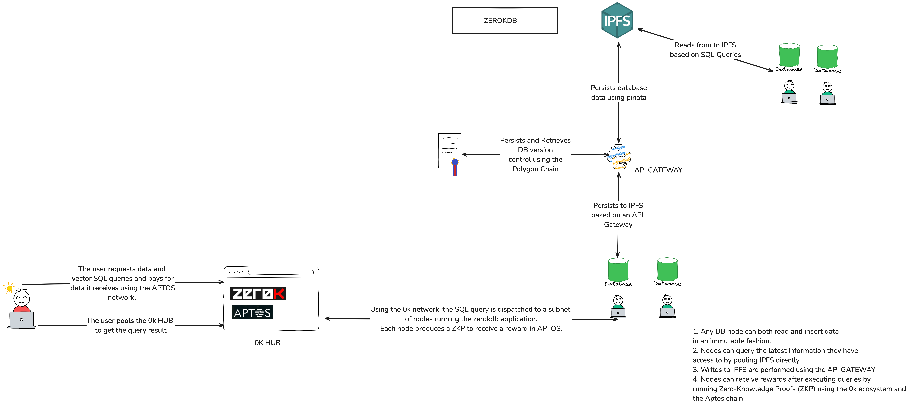

# ZEROKDB

ZEROKDB is a lightweight protocol and file-based database system with support for basic SQL operations and vector similarity search. It is designed to be simple and easy to use and fully decentralized. By being part of the [0k labs ecosystem](https://0k.wtf), ZEROKDB it's powered by ZKPs (Zero-Knowledge Proofs) acting as reward confirmation for users providing idle hardware to run the protocol. The rewards are granted in APTOS



## Features

- Create, insert, and query tables using SQL-like syntax.
- Support for various data types including strings, integers, floats, booleans, datetimes, and lists of floats.
- Perform cosine similarity searches on vector data.
- IPFS support for distributed storage.
- Decentralized version controll powered by a smart contract
- Change tracking for database operations.


## Installation

To install the necessary dependencies using Poetry, use the following command:

```bash
poetry install
```

## Usage

### Creating a Table

To create a table, use the `CREATE TABLE` command:

```sql
CREATE TABLE users (id int, name string)
```

### Inserting Data

To insert data into a table, use the `INSERT INTO` command:

```sql
INSERT INTO users (id, name) VALUES (1, 'Alice')
```

### Querying Data

To query data from a table, use the `SELECT` command:

```sql
SELECT * FROM users
```

### Vector Similarity Search

To perform a cosine similarity search on vector data, use the `COSINE SIMILARITY` clause:

```sql
SELECT id FROM vectors COSINE SIMILARITY embedding WITH [0.1, 0.2, 0.3]
```

### Limiting Results

To limit the number of results returned, use the `LIMIT` clause:

```sql
SELECT * FROM users LIMIT 10
```

## Running Tests

To run the tests for this project, follow these steps:

0. **Configure your .env file**

   Create a .env file out of the .env.example file on the root folder:
   ```bash
   PROVIDER_URL="http://localhost:8545"  # Local Ethereum node
   CONTRACT_ADDRESS="0xDc64a140Aa3E981100a9becA4E685f962f0cF6C9"  # Replace with your deployed contract address
   ABI_PATH="contracts/artifacts/contracts/TableSequences.sol/TableSequences.json"  # Replace with the path to your contract's ABI
   FROM_ADDRESS="0xf39Fd6e51aad88F6F4ce6aB8827279cffFb92266"  # Replace with your Ethereum address (Default from local hardhat node)
   PRIVATE_KEY="0xac0974bec39a17e36ba4a6b4d238ff944bacb478cbed5efcae784d7bf4f2ff80"  # Replace with your private key (Default from local hardhat node)
   PINATA_API_KEY=
   API_HOST="http://localhost:8000"
   ```

1. **Start the local Hardhat node:**

   Open a terminal and run the following command to start a local Ethereum node using Hardhat:

   ```bash
   npx hardhat node
   ```

2. **Deploy the contract:**

   In a new terminal, deploy the contract to the local Hardhat network:

   ```bash
   npx hardhat run contracts/scripts/deploy.js --network localhost
   ```

3. **Run Hardhat tests:**

   Execute the tests for the smart contracts:

   ```bash
   npx hardhat test
   ```

4. **Run FastAPI with Uvicorn:**

   Start the FastAPI server using Uvicorn:

   ```bash
   uvicorn zerokdbapi.main:app --reload
   ```

   The API will be available at `http://127.0.0.1:8000`.

5. **Run the python tests:**
   ```bash
   pytest
   ```

## NOTES:

Although the database nodes can be fully decentralized, this project relies on a central authority for persisting data on ipfs. 

### Forking the protocol
If you wanna setup and run your own application our of **zerokdb**, you will have to configure a pinata account capable of pinning files to IPFS, and you must
deploy the rest api present on the ```zerokdbapi/``` folder.
- Consider running the REST API on akash to have a decentralized infraestructure. 

### Running a node
If you just wanna run your own node in the **zerokdb** network you will need a pinata account to read from IPFS. 


## Contributing

Contributions are welcome! Please feel free to submit a pull request or open an issue.

## License

This project is licensed under the MIT License.
